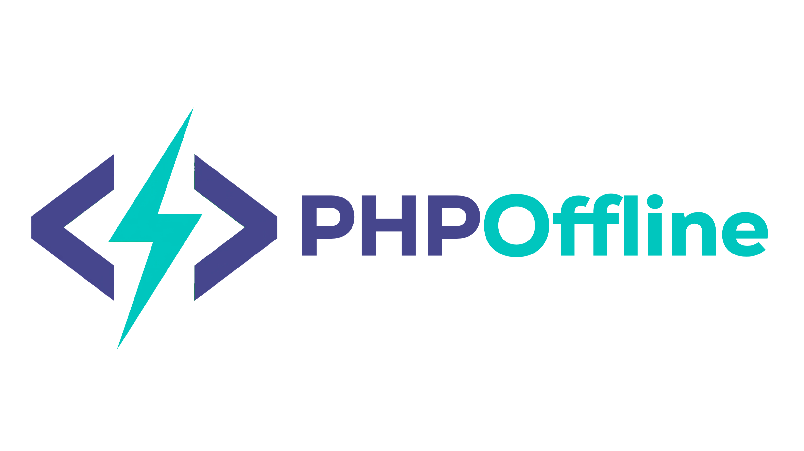

<p align="center">
  
</p>

<h1 align="center">PHPOffline 🚀</h1>

<p align="center">
  Turn any traditional PHP web application into a fully offline-capable app — right inside the browser.
</p>

<p align="center">
  <a href="https://opensource.org/licenses/MIT"></a>
  <a href="https://www.php.net/"></a>
  
</p>

---

**PHPOffline** is a lightweight, dependency-light PHP library that adds offline support to any existing PHP website — no framework required. It combines a Service Worker, Google Workbox caching, an automatic CDN localizer, and an experimental client-side PHP execution bridge (PHP-WASM) into one drop-in package.

## 🔥 Features

- **One-Click Offline Setup** — a ready-made settings-card UI lets end users enable offline mode with a single tap; progress is shown live.
- **CDN Auto-Downloader** — scans your page's HTML output, finds external `<link>`/`<script>` CDN assets (Font Awesome, Google Fonts, Bootstrap, etc.), downloads them, and rewrites the page to use local copies automatically.
- **Service Worker Caching** — `sw.js` precaches your app shell and serves it from cache when the network is unavailable.
- **Resilient by Design** — if [Workbox](https://developer.chrome.com/docs/workbox/) isn't available (missing, not downloaded yet, or fails to load), the service worker automatically falls back to a dependency-free native cache-first strategy, so offline mode still works.
- **Experimental Client-Side PHP (PHP-WASM)** — a bridge (`php-wasm.js`) for running PHP code directly in the browser via WebAssembly when there's no server connection. *(See [Limitations](#-known-limitations--roadmap) below.)*
- **Offline SQLite Storage** — `DatabaseManager` gives you a simple local SQLite store for persisting data offline and syncing it back to your server later.
- **Broad PHP Compatibility** — no typed properties, no PHP 7.4/8.0-only syntax. Written to run on plain PHP 5.6+ so it works even on older/embedded PHP builds (e.g. Android PHP-server apps).

---

## 📁 Directory Structure

```text
PHPOffline/
├── composer.json                  # Package metadata (optional, for Composer users)
├── package.json                   # Node/NPM dependencies (for building Workbox, if used)
├── readme.md                      # This file
├── src/                           # PHP core backend logic
│   ├── PHPOffline.php             # Main initialization class
│   ├── CdnDownloader.php          # Scans & localizes external CDN assets
│   └── DatabaseManager.php        # Offline SQLite database handler
├── assets/                        # Client-side assets
│   ├── workbox/
│   │   └── workbox-sw.js          # Workbox library (see setup note below)
│   ├── js/
│   │   ├── php-wasm.js            # PHP WebAssembly engine bridge
│   │   └── offline-setup.js       # Installer script & progress UI logic
│   └── sw.js                      # Service Worker
└── templates/
    └── offline-settings-card.php  # Drop-in "Enable Offline Mode" UI card
```

---

## 💻 Installation

### Option A — Manual (recommended, zero dependencies)

1. Copy the whole `PHPOffline/` folder into your project root.
2. Include the core classes and initialize PHPOffline near the top of your entry file(s) — ideally in a shared bootstrap/config file that every page already includes:

```php
require __DIR__ . '/PHPOffline/src/PHPOffline.php';
require __DIR__ . '/PHPOffline/src/CdnDownloader.php';
require __DIR__ . '/PHPOffline/src/DatabaseManager.php';

use PHPOffline\PHPOffline;

$phpOffline = new PHPOffline([
    'app_name'           => 'My App',
    'database'           => 'my_app_offline.sqlite',
    'auto_localize_cdns' => true,
]);

$phpOffline->init(); // starts output buffering — must run before any HTML is echoed
```

### Option B — Composer

```bash
composer require nasimdev95/phpoffline
```

```php
require_once __DIR__ . '/vendor/autoload.php';

use PHPOffline\PHPOffline;

$phpOffline = new PHPOffline([
    'app_name' => 'My App',
]);
$phpOffline->init();
```

---

## 🛠️ Quick Start

**1. Add the "Enable Offline Mode" card** anywhere in your settings/dashboard page:

```php
<?php include __DIR__ . '/PHPOffline/templates/offline-settings-card.php'; ?>
```

**2. Serve your site over `https://`, or `http://localhost` / `http://127.0.0.1`.**
Service Workers only run in a [secure context](https://developer.chrome.com/docs/devtools/application/service-workers/), so plain IPs like `0.0.0.0` or non-`localhost` `http://` addresses **will not work** — the browser will refuse to register the Service Worker.

**3. Add a real Workbox build (recommended).**
The repo ships an empty placeholder at `assets/workbox/workbox-sw.js` — drop in the actual [Workbox SW bundle](https://developer.chrome.com/docs/workbox/modules/workbox-sw) there for advanced per-resource caching strategies. Without it, `sw.js` automatically falls back to a simpler native cache-first strategy, so basic offline support still works out of the box.

That's it — click **"Setup Offline Support"** on the settings card while online, then try reloading with the network off.

---

## ⚡ How It Works

1. **User Action** — the user taps *Setup Offline Support* on the settings card.
2. **Asset Mirroring** — `CdnDownloader` scans the rendered HTML, detects external CDN `<link>`/`<script>` tags, downloads them, and rewrites the page to point at local copies.
3. **Service Worker Registration** — `offline-setup.js` registers `sw.js`, which precaches the app shell (and, if a real Workbox build is present, applies smarter per-resource caching rules).
4. **Offline Requests** — once offline, the Service Worker intercepts fetches and serves cached responses. Dynamic pages still requiring server-side PHP fall back to whatever was last cached; for true client-side PHP execution offline, see the PHP-WASM bridge below.

---

## ⚠️ Known Limitations & Roadmap

- **Static content works fully offline out of the box** (HTML, CSS, JS, images, fonts). **Dynamic pages that depend on server-side PHP/database logic will not execute server code while offline** — only their last-cached response is served, unless you build out the PHP-WASM path yourself.
- **PHP-WASM bridge is experimental.** `php-wasm.js` currently loads the [`@php-wasm/web`](https://www.npmjs.com/package/@php-wasm/web) engine from a public CDN on first use, so it needs one initial online load before it can run PHP client-side. To make this fully offline from the start, vendor the `@php-wasm/web` package locally under `assets/` and point `php-wasm.js` at that local path.
- **Workbox is not bundled** — `assets/workbox/workbox-sw.js` ships empty to keep the repo lightweight and avoid distributing a third-party build. `sw.js` will try to load it, then fall back to a CDN copy, then finally to a native cache-first strategy if both fail — so the library degrades gracefully either way.
- **PDO SQLite** (`pdo_sqlite`) must be enabled in your PHP build for `DatabaseManager` to work; if it's missing, offline data storage is disabled but the rest of the library still functions.

Contributions that flesh out any of the above are very welcome — see below.

---

## 🤝 Contributing

Issues and pull requests are welcome. If you're fixing a compatibility bug, please test against an older PHP version (5.6/7.x) where possible, since broad compatibility is a core goal of this project.

## 📄 License

This project is open-source software licensed under the [MIT License](https://opensource.org/licenses/MIT).

## 👤 Author

Developed by **Nasim Akhtab**
GitHub: [@NasimDev95](https://github.com/NasimDev95)
